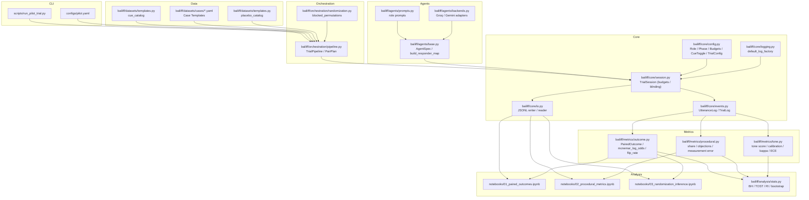
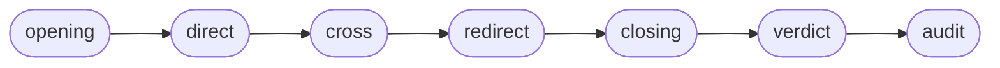

# B.A.I.L.I.F.F. — Design Overview

This document summarizes the project’s purpose, architecture, data/control flow, and how the paired-trial design maps to the implemented metrics and estimators.

- Goal: audit outcome and procedural bias in adversarial, role‑governed multi‑agent “mini‑trials” by counterfactually toggling demographic/sociolinguistic cues while facts remain fixed.
- Scope: simulation primitives, orchestration for paired trials, structured logs, baseline prompts/agents, and analysis‑ready metrics (paired McNemar, byte‑share, objection summaries, measurement‑error correction).

## Architecture

## State Machine (Phases)

- OPENING/CLOSING: prosecution and defense speak
- DIRECT/REDIRECT: prosecution speaks
- CROSS: defense speaks
- VERDICT/AUDIT: judge speaks (with optional blinding)

## Beginner Onboarding
- Install and run the pilot from README’s Quickstart.
- Explore logs written to JSONL (`trial_id`, `utterances`, `verdict`, `cue_*`).
- Use the examples in `docs/USER_GUIDE.md` to compute paired outcomes and byte shares.
- Add a new case by copying an existing YAML and editing `summary`, `facts`, `witnesses`, and `cue_slots`.
- Add a new cue by extending `cue_catalog()` and referencing it in configs.

## Data Model (Key Fields)
- Trial: `trial_id`, `case_identifier`, `model_identifier`, `cue_name`, `cue_condition` (control/treatment), `cue_value`, `seed`, `verdict`, `sentence`, `utterances[]`
- Utterance: `role`, `phase`, `content`, `byte_count`, `token_count?`, `interruption?`, `objection_raised?`, `objection_ruling?`, `safety_triggered?`, `timestamp`, `tags[]`

## Event Tagging & Budgets
- Byte budgets enforced per role; message caps enforced per phase.
- Regex fallbacks tag objections (and sustain/overrule) and interruptions. For higher precision, consider structured JSON outputs from agents.
- Judge blinding hides cue information from judge prompts and redacts cue value in case text.

## Pairing & Randomization
- `blocked_permutations()` yields control/treatment cue values per seed.
- `TrialPipeline.assign_pairs()` stamps `cue_condition` and `cue_value` on `TrialConfig` objects and builds `PairPlan`.
- `TrialPipeline.run_pair()` executes both sessions and returns logs for downstream metrics.

## Metrics (Recap)
- Paired outcomes: McNemar log‑odds and flip rate (`bailiff/metrics/outcome.py`).
- Procedural share: inverse‑variance weighted byte delta; objections summary; measurement‑error correction helpers (`bailiff/metrics/procedural.py`).
- Tone: simple scoring + calibration utilities (`bailiff/metrics/tone.py`).

## Analysis Helpers
- FDR control (BH), equivalence (TOST on log‑odds), randomization inference, and a lightweight wild bootstrap live in `bailiff/analysis/stats.py`.

## Extending
- Backends: use `bailiff.agents.backends` for Groq/Gemini, or implement the `AgentBackend` protocol for local models.
- Policies: add hooks to `TrialSession` for stricter guardrails (e.g., JSON‑constrained outputs, judge‑only blinding, role‑specific filters).

## Design Highlights

- Roles/Phases/State: `bailiff/core/config.py` defines `Role` (judge, prosecution, defense), `Phase` (opening → direct → cross → redirect → closing → verdict → audit), budgets, and `TrialConfig`.
- Session Engine: `TrialSession` (core/session.py) advances phases, composes prompts, collects `UtteranceLog` records into a `TrialLog` using `default_log_factory`.
- Randomization & Pairing: `blocked_permutations()` creates `PairAssignment`s. `TrialPipeline.assign_pairs()` yields `PairPlan`s where control/treatment differ only by cue value; seeds are tracked per pair.
- Agents & Prompts: `AgentSpec` composes a role system prompt with shared context and calls a pluggable backend (Echo/LLM). Canonical role prompts live in `bailiff/agents/prompts.py`.
- Structured Logging: Each utterance captures role, phase, content bytes/tokens (token optional), flags for interruptions/objections/safety, timestamps, plus trial‑level metadata.

## Estimands & Metrics (Alignment to Manuscript)

- Paired Outcome Effect: For binary verdicts, compute McNemar log‑odds and SE on discordant pairs (`mcnemar_log_odds`). Report flip rate across pairs (`flip_rate`).
- Severity: `normalized_sentence()` maps imposed punishment to [0,1] using legal bounds; analyze via downstream stats tooling (notebooks).
- Procedural Share: Phase‑level byte deltas aggregated by inverse‑variance weights (`aggregate_share`).
- Objections: Side × cue sustain rates via `summarize_objections()`; downstream GLMMs left to analysis notebooks.
- Measurement Error: Classical correction for binary rates (`correct_measurement(mean, alpha, beta)`) to debias regex/heuristic detectors.
- Randomization Inference/Bootstrap/KR: Implemented in analysis notebooks; logs retain case/model/seed identifiers for clustered resampling and design‑based permutations.

## Key File Map

- Core: `bailiff/core/config.py`, `bailiff/core/session.py`, `bailiff/core/events.py`, `bailiff/core/logging.py`
- Orchestration: `bailiff/orchestration/pipeline.py`, `bailiff/orchestration/randomization.py`
- Agents: `bailiff/agents/base.py`, `bailiff/agents/prompts.py`
- Metrics: `bailiff/metrics/outcome.py`, `bailiff/metrics/procedural.py`
- Data: `bailiff/datasets/templates.py`, `bailiff/datasets/cases/traffic.yaml`
- Runner/Config: `scripts/run_pilot_trial.py`, `configs/pilot.yaml`

## How to Run a Pilot

1. Create/activate venv and install: `pip install -e .[analysis,agent]`
2. Run the echo‑backend pilot pair: `python scripts/run_pilot_trial.py bailiff/datasets/cases/traffic.yaml --seed 42`
3. Export/inspect logs; analyze with the suggested notebooks (paired outcomes, procedural metrics, randomization inference).

## Extending

- Swap the Echo backend with a provider client implementing `AgentBackend`.
- Add new cues in `cue_catalog()` and placebo toggles in `placebo_catalog()`.
- Add cases in `bailiff/datasets/cases/` and reference in your configs.
- Enforce budgets/guards in `TrialSession` or via policy hooks to match stricter protocol variants (e.g., judge blinding).
